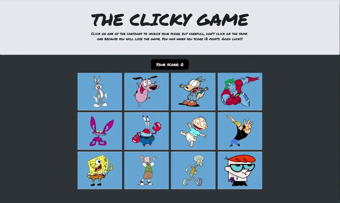

# THE CLICKY GAME

"THE CLICKY GAME" is a simple and fun memory game build on React. Here are the rules: Click on one of the cartoons to increase your score, but careful, don't click on the same one because you will lose the game. You win when you score 12 points. Now let's see if you have a sharp memory [Click here](https://tomslemenson.github.io/Clicky_Game/) to play the game!

